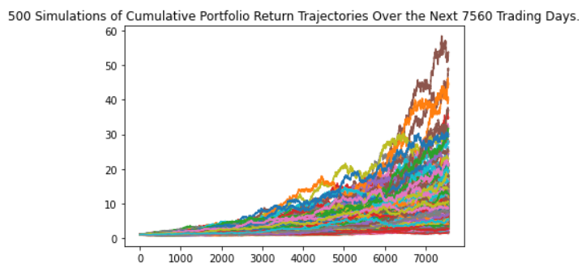
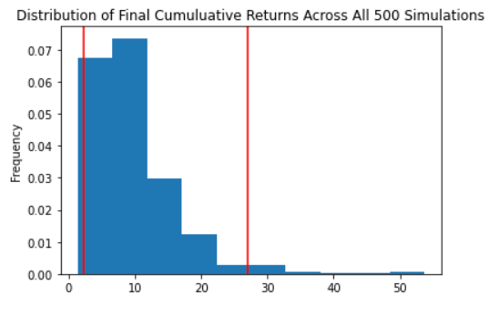

# API Homework
## Using a monte carlo simulation to forecast live data using the Alpaca API

Portfolio tickers = AGG, SPY

## Simulation graphs:

### Monte Carlo Simulation

### Simulation Distribution

There is a 95% chance that an initial investment of $30000.0 in the portfolio over the next 30 years will end within in the range of $66542.9 and $808944.01

